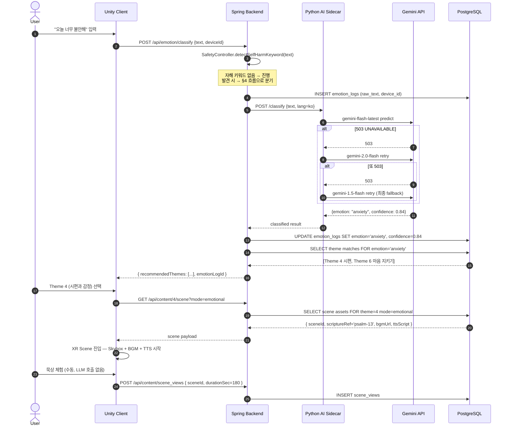
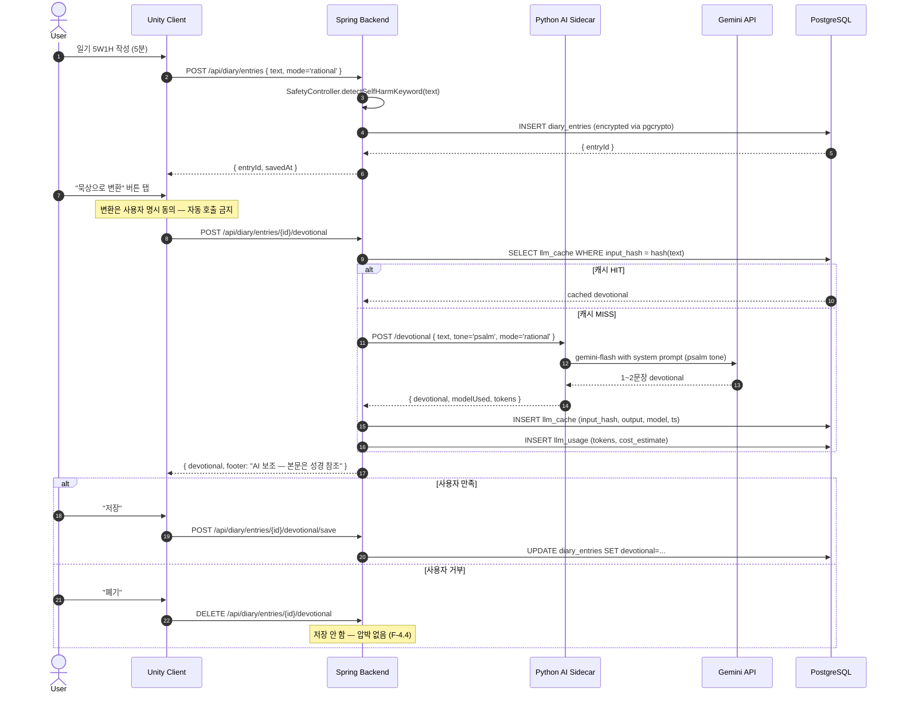
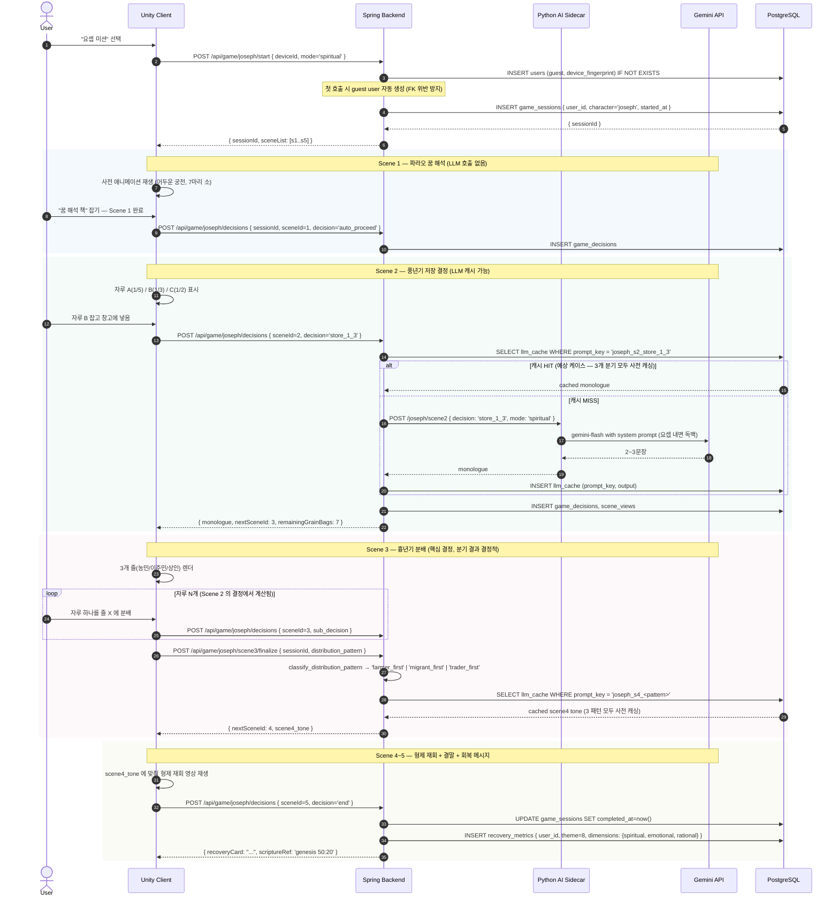
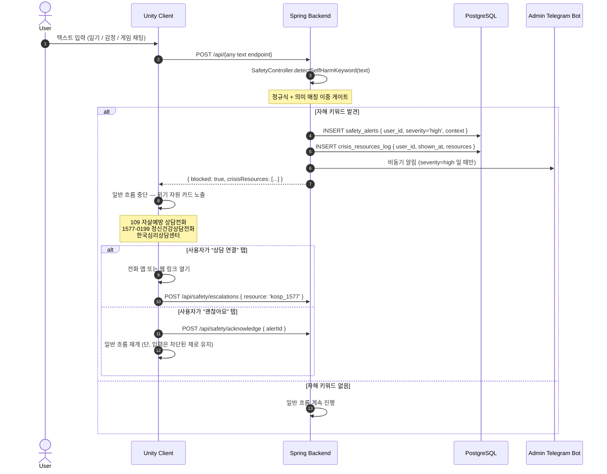
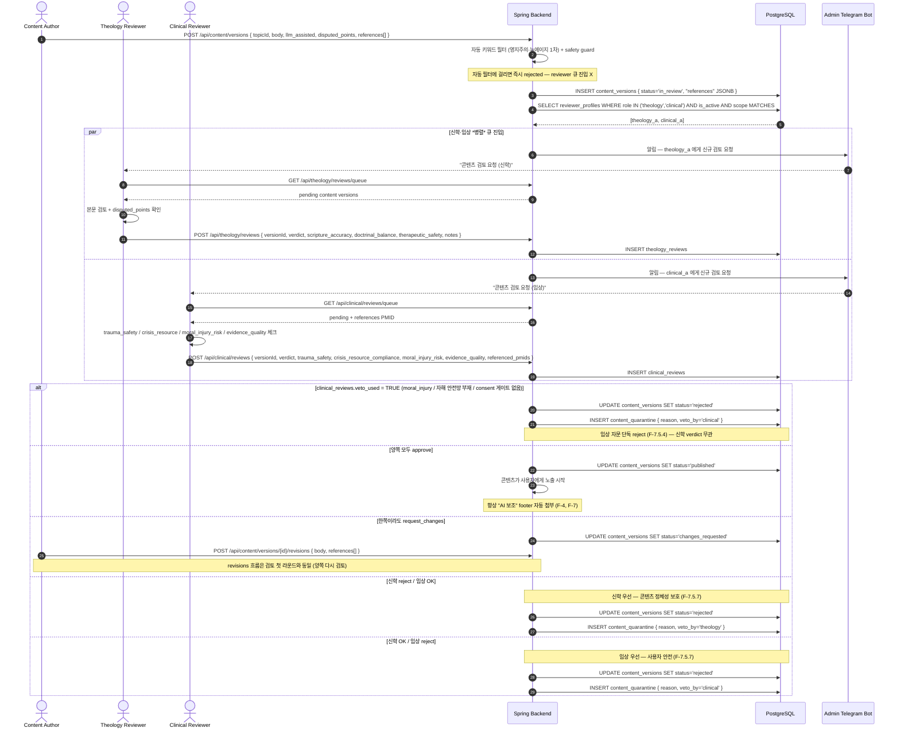
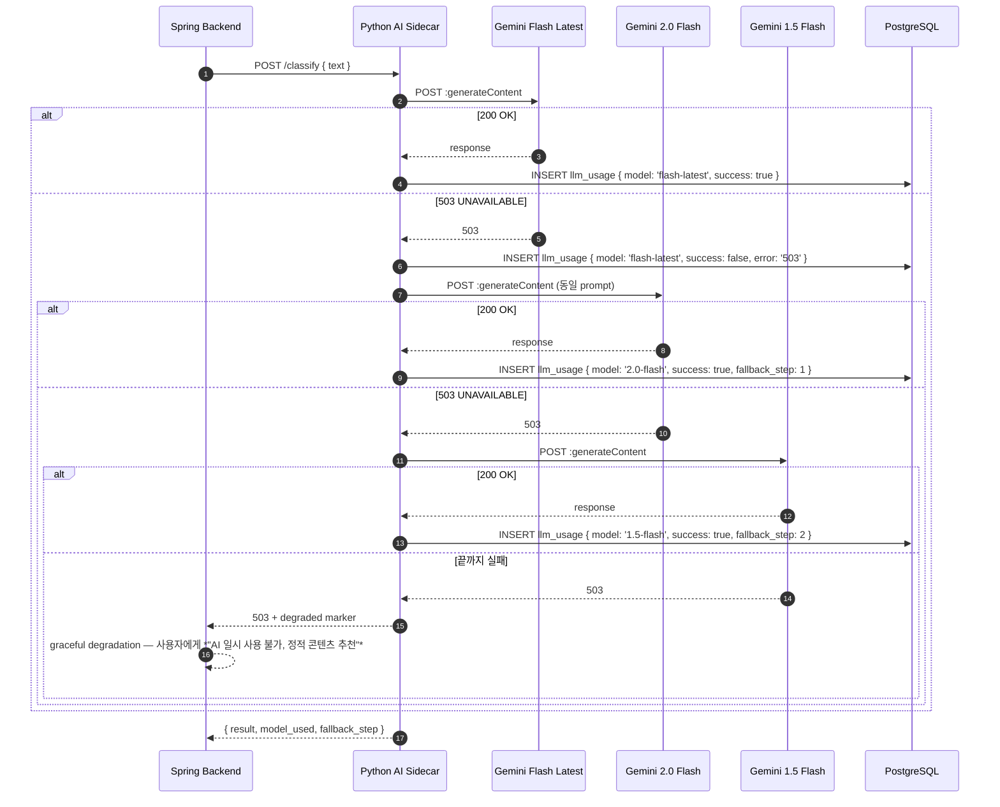
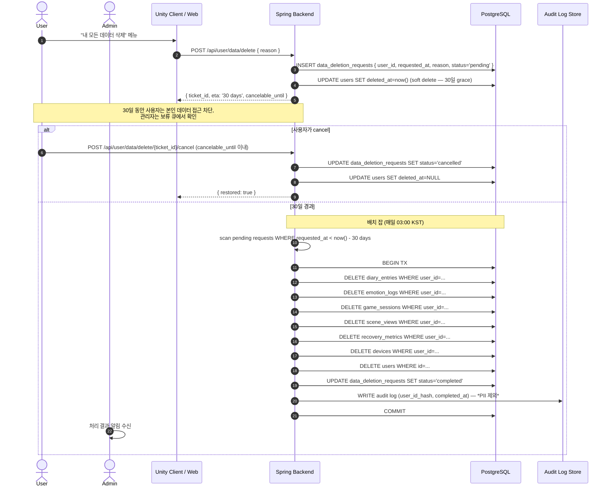

# 시퀀스 다이어그램 — Lemuel XR

> **렌더링**: GitHub 마크다운에서 Mermaid 자동 렌더링. 로컬 미리보기는 VSCode `Markdown Preview Mermaid Support` 확장.
> **상위 문서**: [`FUNCTIONAL-SPEC.md`](FUNCTIONAL-SPEC.md), [`BUILD-PLAN.md`](BUILD-PLAN.md), [`DB-SCHEMA.md`](DB-SCHEMA.md)
> **범위**: 가장 자주 발생하는 7개 시나리오. 엣지 케이스는 각 다이어그램 하단 *Notes* 참고.

---

## 0. 등장 액터

| Actor | 무엇 |
|---|---|
| **User** | XR 헤드셋 (Quest / Vision Pro / Galaxy XR) 또는 Web 클라이언트 |
| **Unity Client** | XR 프론트엔드 — 입력·렌더링·인터랙션 |
| **Spring Backend** | Spring Boot 3.5.4 (JDK 21) — 헥사고날 application/adapter |
| **Python AI Sidecar** | FastAPI 등 — LLM / TTS / 임베딩 호출 책임 |
| **Gemini API** | Google AI Studio / Vertex AI — LLM 추론 |
| **PostgreSQL** | 17 + pgvector |
| **Reviewer** | 신학 리뷰어 (role=`theology_reviewer`) |
| **Admin** | 관리자 (데이터 삭제 처리 등) |

---

## 1. 트랙 A — 감정 입력 → Theme 추천 → XR Scene 진입

> F-1.3 + F-2.x + F-5.4 (fallback chain) 의 happy path.

**Notes**
- LLM 분류는 **사이드카 경유** — Spring 도메인이 Gemini 모델 이름을 모름 (헥사고날 규칙).
- fallback chain 은 `Python AI Sidecar` 내부에서 처리. Spring 입장에선 한 번의 호출.
- Scene asset 은 *정적 콘텐츠* (DB 또는 CDN) — LLM 추가 호출 없음.
- `mode=emotional` 은 F-1.4 의 영성/감성/이성 분기 중 하나. Scene 톤·내레이션이 모드별로 분기.

---

## 2. 일기 작성 → AI 묵상 변환 (옵션)

> F-2.1 + F-4.1 + F-7 신학 검증 게이트.

**Notes**
- 일기 본문은 `pgcrypto` row-level 암호화 (F-8.3).
- LLM 출력은 *항상* "AI 보조" footer 동반 — 사용자 UI 에서 분리 표시 (F-4.4, F-7).
- 사용자가 *"AI 가 답하지 말기"* 토글이 ON 이면 묵상 변환 버튼 자체가 disabled (F-6.3).
- 변환 결과는 *기본 폐기* — 저장은 사용자 명시 동의 필요.

---

## 3. 트랙 B 게임 — 요셉 미션 한 세션

> F-3.1 의 5 Scene 흐름. Scene 2~3 의 LLM 캐시 전략 포함.

**Notes**
- Scene 2 의 3개 분기 × Scene 3 의 3개 분기 = 9 패턴 — 모두 *사전 캐싱* 가능. **LLM 실시간 호출 0회** 도 달성 가능.
- 게스트 user 자동 생성은 `users` FK 위반을 막기 위한 단계 — 최근 commit `72a9420` 가 정확히 이 패턴 적용.
- `recovery_metrics` 는 사후 분석용 — 3차원 모드별 어떤 회복 효과가 있었는지 측정.
- 미완료(중도 이탈) 시 `completed_at` NULL → 다음 진입 시 *"이어서 하시겠어요?"* 옵션 (Phase 2).

---

## 4. 자해 키워드 감지 → 위기 자원 안내 (안전 게이트)

> F-6.1 — 모든 사용자 텍스트 입력에 적용되는 *우선 분기*.

**Notes**
- 정규식만으로는 false negative 가 많음 — 의미 매칭(임베딩 유사도) 이중 게이트 (F-6.1).
- *severity=high* 경우 Admin Telegram 봇으로 비동기 알림. PII 는 포함하지 않음 (user_id 만).
- 자해 키워드가 검출된 텍스트는 **저장하지 않거나** 별도 보호 컬럼에 격리. 일반 일기 테이블에 그대로 두지 않음.
- 사용자가 *"괜찮아요"* 를 눌러도 *그 입력 자체는 차단*. 일반 흐름으로 돌려보내되 그 텍스트는 처리하지 않음.

---

## 5. 신학·임상 *병렬* 검증 워크플로 (AI 출력 → 게시까지)

> F-7 + F-7.5 — 모든 새 콘텐츠가 거치는 *2-축 게이트*. 신학 자문과 임상 자문이 *동시에* 검토 큐에 진입. 양쪽 모두 `approve` 여야 published.
> 거버넌스 상세: [`docs/governance/CLINICAL-REVIEW.md`](governance/CLINICAL-REVIEW.md)

**Notes**
- `disputed_points` 는 작성자가 *명시적으로* 등록 — "이 부분은 해석 분쟁 가능" 표시.
- **2-of-2 approve 필수 콘텐츠** (F-7.5.8): Theme 11 (예수) 모든 콘텐츠 + trigger_warning=high Scene. 같은 role 의 *두 자문가가 모두* approve.
- 자동 키워드 필터 (영지주의·뉴에이지) 가 1차 필터링 — 리뷰어가 보는 큐에 *이미 깨끗한 후보* 만 도달.
- `references` JSONB 의 PMID 와 `clinical_reviews.referenced_pmids` 가 *cross-check* — 인용 근거 부적절 시 evidence_quality 점수 감점.
- SLA (F-7.5.9): routine 5 영업일 / 고난 narrative 10 영업일 / F-6 안전장치 변경 3 영업일 (긴급).
- **Conflict of interest** (F-7.5.10): 자문가가 본인 작성 콘텐츠 검토 불가 — `reviewer_id ≠ content_versions.created_by` 가드.
- Veto 단독 권한은 *임상 자문* 만 (사용자 안전 우선 원칙). 신학 자문은 *2-of-2 거부* 만 효력.

---

## 6. Gemini fallback 모델 체인 (Python AI Sidecar 내부)

> F-5.4 — `gemini-flash-latest` 가 자주 503 UNAVAILABLE 을 반환하는 운영 사고에 대한 대응. (최근 commit `fca2292` 가 정확히 이 패턴.)

**Notes**
- 한 endpoint 당 *최대 3 번* 시도 — 무한 폴백 금지.
- `llm_usage` 에 각 시도의 모델·성공 여부·fallback_step 기록 — 어떤 모델이 가장 안정적인지 사후 분석 가능.
- 끝까지 실패 시 *graceful degradation* — 사용자에게 빈 화면 대신 *정적 콘텐츠* 노출.
- 이 흐름은 **Python 사이드카 안에서 완결** — Spring 입장에선 한 번의 호출이며 fallback 인지 모름.

---

## 7. 사용자 데이터 삭제 요청 (GDPR / 개인정보보호법)

> F-8.2 — 30일 내 처리.

**Notes**
- *Soft delete* 30일 grace 기간 — 실수 클릭 방지.
- 삭제 후 *익명 통계* 는 유지: 어떤 Theme 이 인기 있었는지 등. 단 `user_id` 는 hash 처리.
- `pgcrypto` 로 암호화된 row 도 함께 삭제 — 키 폐기로는 부족 (실제 row 제거).
- 30일 grace 동안에도 데이터 접근은 차단 (해당 사용자에게).

---

## 8. 시퀀스 다이어그램 작성 컨벤션

다음 다이어그램을 추가할 때는 같은 컨벤션을 유지한다.

| 컨벤션 | 규칙 |
|---|---|
| **autonumber** | 항상 켠다 — 사후 토론 시 step 번호로 참조 가능 |
| **actor** | 사람 / Admin 봇은 `actor`, 시스템 컴포넌트는 `participant` |
| **rect** | Scene·Phase 묶음에 사용 — 다른 색조로 그룹 시각화 |
| **alt / else / loop** | 분기 / 반복 명시. *항상* notes 하단에 엣지 케이스 설명 |
| **Notes (하단)** | 다이어그램 *외부* 의 의사결정 / 운영 노트는 본문 하단에 |
| **헥사고날 경계 존중** | `Spring Backend` 는 LLM 모델 이름을 호출하지 않음 — 항상 `Python AI Sidecar` 경유 |

추가 후보 (작성 미정):
- 신학 리뷰어 임명 / 권한 위임 흐름
- B2B 교회 단체 구독 결제 흐름 (Phase 3+)
- 익명 기도 매칭 흐름 (Phase 3+)
- 다국어 번역 캐시 흐름 (Phase 3+)
