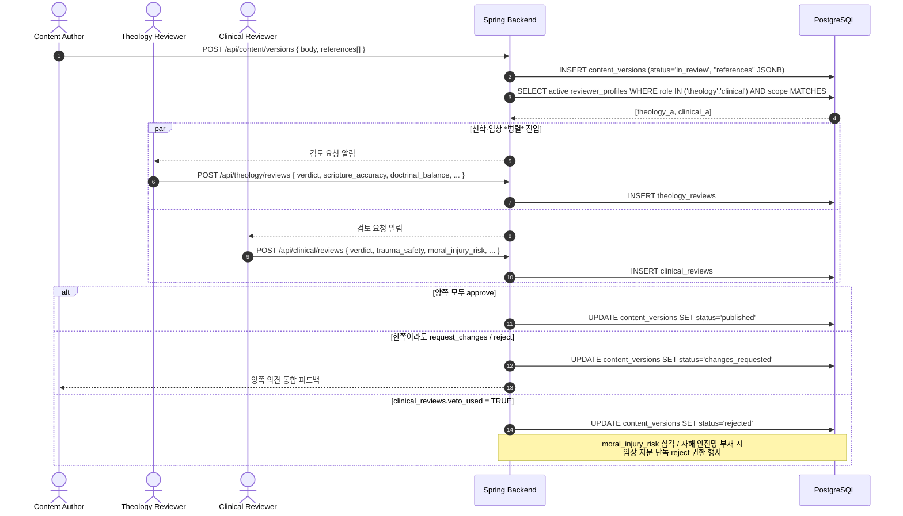

# 임상 검토 거버넌스 — Clinical Review

> **이슈**: [#4 — 임상자문 영입 (Milstein 2025 COPE 프레임워크)](https://github.com/MyoungSoo7/lemuel-xr/issues/4)
> **상위 문서**: [`FUNCTIONAL-SPEC.md`](../FUNCTIONAL-SPEC.md) §F-7 (신학 검증) → §F-7.5 (임상 검증, 본 문서)
> **관련 다이어그램**: [`SEQUENCE-DIAGRAMS.md`](../SEQUENCE-DIAGRAMS.md) §5 (신학·임상 병렬 검증)
> **DB 스키마**: `reviewer_profiles` + `clinical_reviews` + `content_versions."references"` JSONB (V20260521040956)
> **학술 근거**: [`docs/research/MENTAL-HEALTH-PAPERS.md`](../research/MENTAL-HEALTH-PAPERS.md) §14

---

## 0. 한 줄 정의

lemuel-xr 의 모든 사용자 노출 콘텐츠는 **신학 자문 + 임상 자문 양쪽 모두 approve** 가 PUBLISHED 의 조건이다.

---

## 1. 왜 임상 검토가 별도 필요한가

신학 자문만으로는 잡지 못하는 4가지 위험:

| 위험 | 신학 자문 | 임상 자문 |
|---|---|---|
| **moral injury** (Jones 2022 [PMID 35609469](https://pubmed.ncbi.nlm.nih.gov/35609469/)) | 정통성은 OK 인데 *피해자에게 moral injury* 발생 가능 | trauma-informed 시각으로 잡음 |
| **자해·자살 위기 신호 응답** | 영적 응답 (기도·말씀) 만으로 부족 — *임상 가이드라인 (CANMAT)* 필요 | Ferguson 2022 SPI / Bryan 2025 JAMA RCT 직접 적용 |
| **DBT/ACT 효과 일반화 범위** | 효과 *과대 인용* 위험 | 임상 표본 효과의 *경계선* 정확히 설정 |
| **VR 매체 한계 정직** | 매체 자체 평가 어려움 | Wiebe 2022 SR 의 *임상 환경 + 가이드 동반* 가정 명시 |

---

## 2. 임상자문 자격 (`reviewer_profiles.role='clinical'`)

다음 중 **하나 이상** 충족:

- 정신과 의사 (대한신경정신의학회 회원)
- 임상심리사 1급 (한국상담심리학회)
- 정신건강 사회복지사 1급
- **추가 자격**: trauma-informed care 훈련 (TF-CBT 인증 / EMDR 인증 등) 우대
- **태도 자격**: 종교·영성 통합 정신건강 (Pargament / Milstein 류) 친화적
- **동의 사항**: lemuel-xr 의 *치료 아님 / 보조 위치* 명시 정책에 동의

`reviewer_profiles` 의 `credential` / `organization` 컬럼에 자격 + 소속 적재. `is_active` 토글로 일시 비활성화 가능.

---

## 3. 검토 워크플로 — 신학 검증과 *병렬*

콘텐츠 작성자가 `content_versions` 에 PENDING 으로 등록하면, **신학 자문 + 임상 자문 양쪽 큐에 자동 진입**. 양쪽 모두 `approve` 여야 `status=published`.

> 위 다이어그램은 `SEQUENCE-DIAGRAMS.md` §5 와 일치하도록 유지. 본 문서가 *governance 측 설명*, SEQUENCE-DIAGRAMS 가 *기술 흐름 측 설명*.

---

## 4. 임상자문 권한

### 4.1 Required review (자동 회부)

다음 콘텐츠 변경은 임상자문 검토 *필수*:

- F-6 안전장치 (자해 키워드 / 위기 자원 catalog / trigger_warning) 변경
- LLM 시스템 프롬프트 변경 (특히 *고난 / 회복 / 트라우마* 어휘 포함)
- 새 Theme MVP 문서 — 특히 Theme 5 (고통과 진리), Theme 11 (예수 십자가) 같은 *고난 narrative*
- 새 Scene 의 `trigger_warning.level >= medium`
- Theme 4 (시편) 의 감정 인증 콘텐츠 변경

### 4.2 Optional review (작성자가 명시 요청 시)

- Theme 1~3 의 *routine* 콘텐츠 (일기·잠언·전도서)
- UI 카피의 *정서 문구* 변경

### 4.3 Veto power — *단독 reject*

다음 경우 임상자문 **단독으로 reject** 가능 (신학 자문 approve 와 무관):

- moral injury 위험 *moral_injury_risk = 1~2 (위험)*
- 자해/자살 안전망 부재 (`crisis_resource_compliance = 1~2`)
- trauma 자극이 *consent 게이트 없이* 사용자 진입 (`trauma_safety = 1~2`)

`clinical_reviews.veto_used = TRUE` + `veto_reason` 필수 (DB CHECK 제약 강제).

---

## 5. 모집 채널 (한국)

| 채널 | 대상 | 비고 |
|---|---|---|
| 대한신경정신의학회 *기독교 정신건강 분과* | 정신과 의사 | 신앙 통합 정신의학 친화 |
| 한국상담심리학회 | 임상심리사 1급 | CBT/ACT/DBT 훈련 보유자 |
| 한국기독교상담심리치료학회 | 기독교 상담심리 전문가 | 종교 통합 임상가 |
| 개인 네트워크 (@MyoungSoo7, @godjinho 등 협업자 추천) | 위 자격 외 추천자 | reviewer_profile 등록 후 검증 |

**최소 2명** 영입 — 1인 검토는 의견 편향 위험. 같은 콘텐츠에 *2/2 approve* 까지는 안 강제 (작업량 폭증 위험), 다만 Theme 11 (예수) / trigger_warning=high Scene 은 **2-of-2 approve 필수**.

---

## 6. 임상자문 보상 / 운영

### 6.1 보상 모델

MVP 단계 (V1.0 / 검증 phase):
- 시간당 명목 보상 또는 *교회·기관 협력* 형태 (Milstein COPE 모델)
- 자문가 본인 *논문·임상 활동 자료* 로 PUBLISHED 콘텐츠 활용 가능 (저작권 표기 포함)

Scale 단계 (V3.0 / B2B 시작):
- 계약 기반 (월 검토 quota + 추가 검토 시간당)

### 6.2 운영 책임자

- **신학 자문 코디네이터**: @MyoungSoo7
- **임상 자문 코디네이터**: (임명 예정 — Issue #4 산출물)
- **양 자문 간 cross-training**: 분기 1회 — Milstein COPE 의 *Education* 축

### 6.3 결정 불일치 시 (escalation)

- *신학 approve / 임상 reject* → 임상 우선 (사용자 안전 우선 원칙)
- *신학 reject / 임상 approve* → 신학 우선 (콘텐츠 정체성 보호)
- *양쪽 approve 인데 운영 정책상 보류* → 운영 책임자 (현재 @MyoungSoo7) 최종 결정

---

## 7. 검토 SLA

| 콘텐츠 종류 | 신학 SLA | 임상 SLA |
|---|---|---|
| Routine (Theme 1~3 일상) | 5 영업일 | 5 영업일 |
| 고난 narrative (Theme 5, 11) | 7 영업일 | 10 영업일 (자료 검토 시간 더 필요) |
| F-6 안전장치 변경 | 3 영업일 (긴급) | 3 영업일 (긴급) |
| LLM 시스템 프롬프트 변경 | 5 영업일 | 5 영업일 |

SLA 초과 시 자동 알림 → 운영 책임자.

---

## 8. 자문가 *Conflict of interest*

- 자문가가 *직접 작성한 콘텐츠* 는 본인 검토 불가 (`clinical_reviews.reviewer_id ≠ content_versions.created_by`)
- 자문가가 *경제적 이해관계* 가 있는 콘텐츠 (예: 자기 책 직접 인용) 는 명시 disclosure 필요
- 자문가가 검토한 콘텐츠는 *PUBLISHED 후* 본인 SNS / 학술 발표 자료로 사용 가능 (조건: lemuel-xr 출처 표기)

---

## 9. 데이터 보호

- 자문가 본인 정보는 `reviewer_profiles.bio` 에 *자문가가 명시 동의한 범위 만*
- 검토 내용 (`theology_reviews.notes`, `clinical_reviews.notes`) 은 운영자 + 작성자 외 노출 금지
- 자문가 검토 *권한 회수* 시 (`is_active=FALSE`) 과거 검토 row 는 보존 (audit)
- GDPR / 개인정보보호법 — 자문가 본인 데이터 삭제 요청 시 `reviewer_profiles` row soft-delete (이력은 `*_reviews` 에 reviewer_id NULL 로 보존)

---

## 10. 다음 액션 (Issue #4 산출물 체크리스트)

- [x] `docs/governance/CLINICAL-REVIEW.md` (본 문서)
- [x] DB 스키마 — `reviewer_profiles`, `clinical_reviews`, `content_versions."references"` (V20260521040956)
- [ ] FUNCTIONAL-SPEC.md §F-7.5 임상 검증 sub-섹션 추가
- [ ] SEQUENCE-DIAGRAMS.md §5 의 mermaid 에 *clinical_review 병렬 분기* 반영 (또는 §6 으로 신규 추가)
- [ ] CLAUDE.md §1 *신학적 검증* 옆에 §1.5 *임상적 검증* 추가
- [ ] 초기 임상자문 1~2명 영입 (외부 작업)
- [ ] `theology_reviews.reviewer_profile_id` FK 추가 마이그레이션 (V8 일관성)

---

> *이 문서는 lemuel-xr 의 거버넌스 정책. 변경 시 신학 + 임상 양 자문 모두 review 후 운영 책임자 승인 필요 (재귀적 — 본 문서가 메타 정책).*
